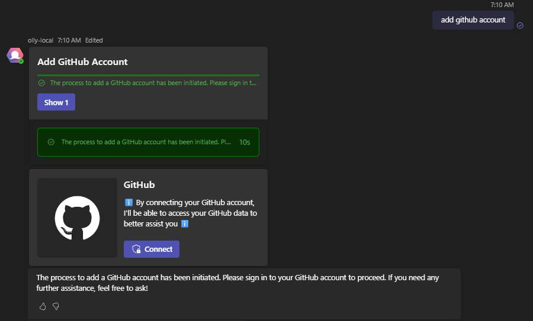
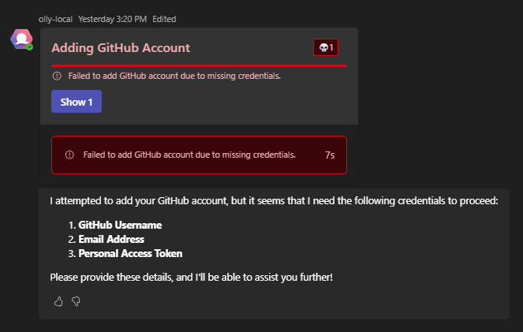
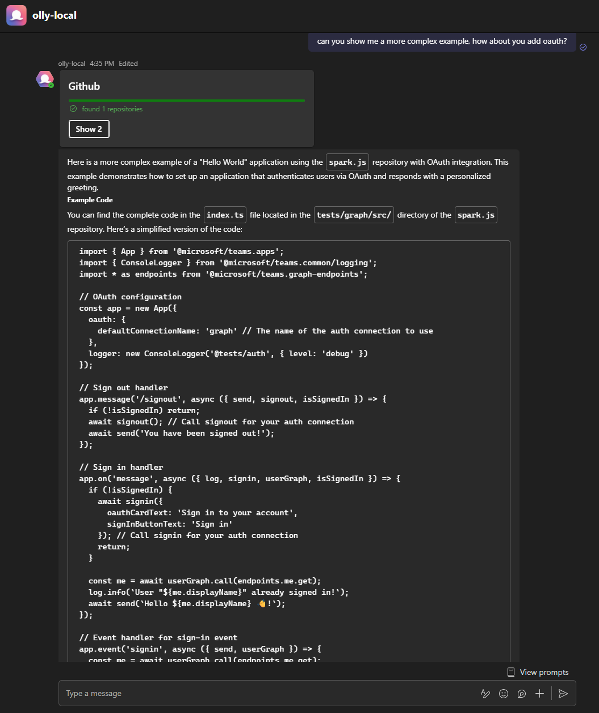
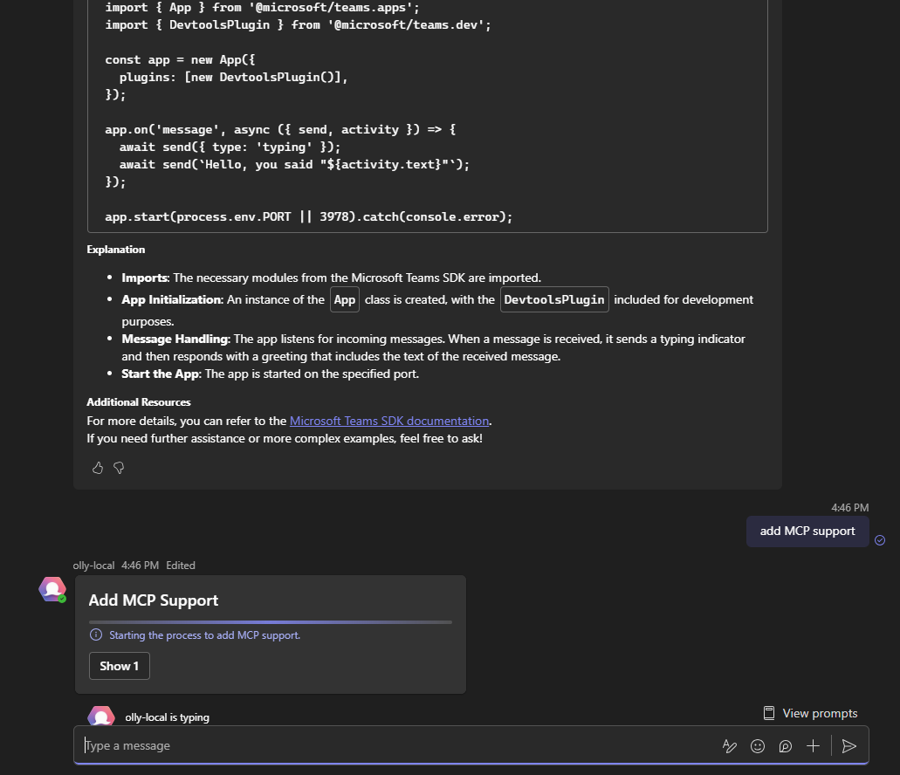
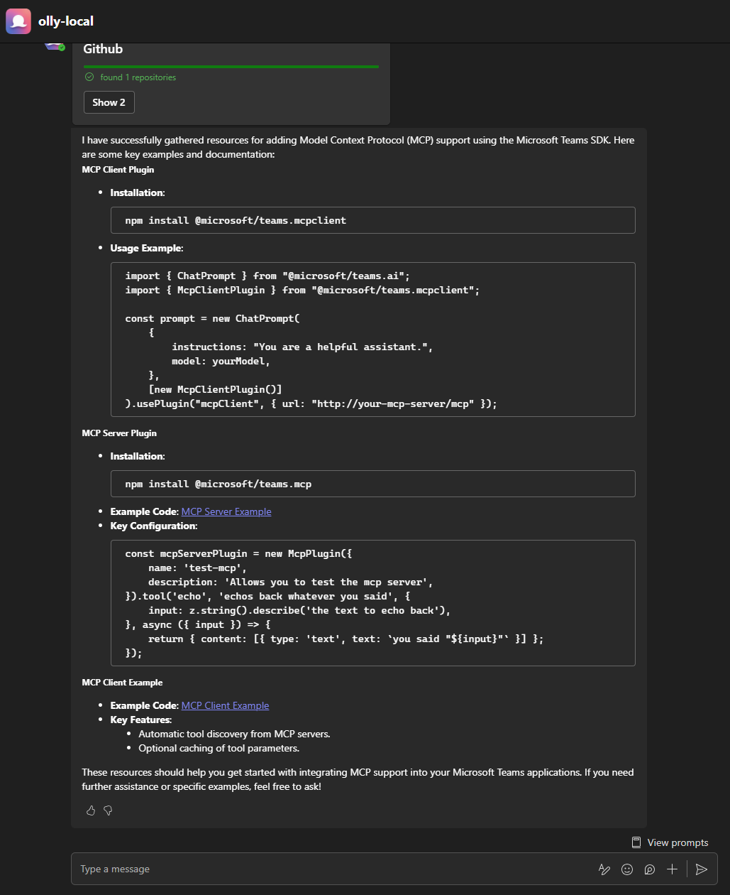
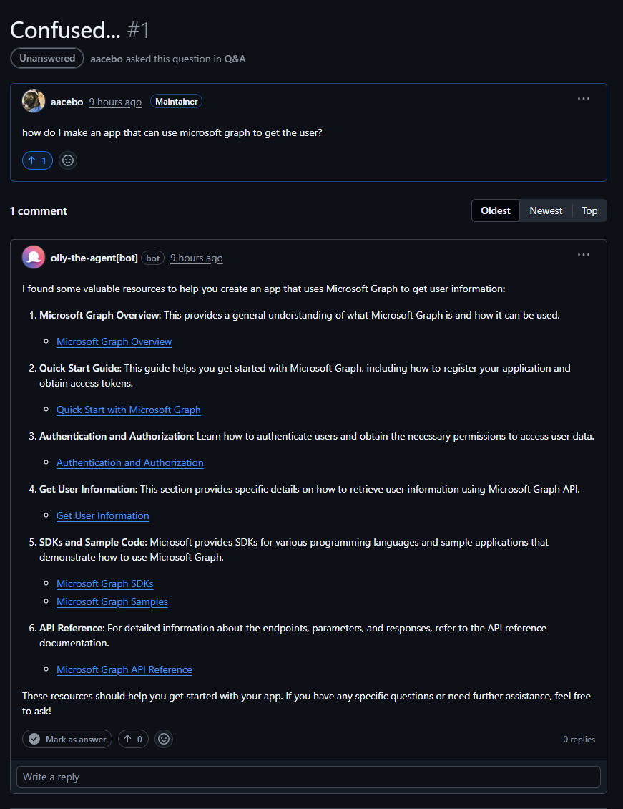
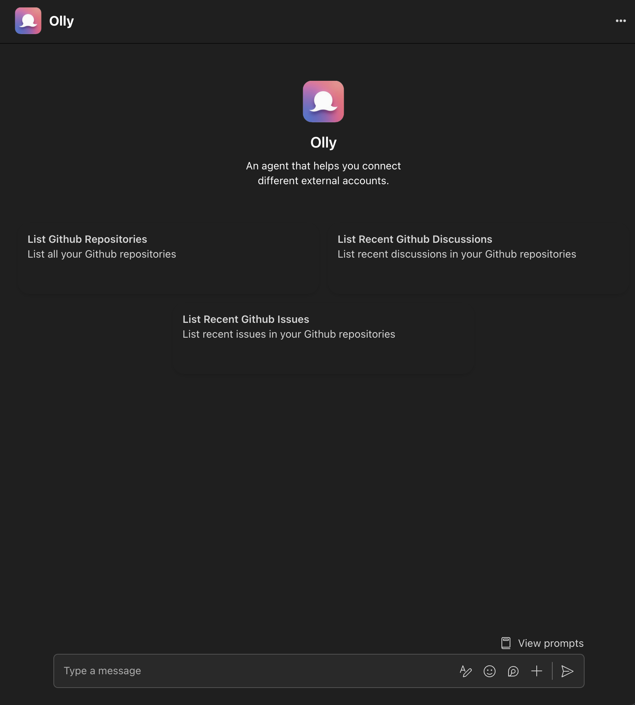

<h1 style="display:flex">
    
    Olly
</h1>

An agent built to be your personal assistant.

Olly can connect different external accounts so that they can be used to automated workflows,
used for RAG, and more!

1. [Adding A New Account](#adding-a-new-account)
2. [Code Expert](#code-expert)
3. [Multi Channel](#multi-channel)
4. [Prompt Starters](#prompt-starters)

## Adding A New Account

Olly communicates status updates for long running or complex tasks, showing you their thought process and any warnings/errors that may occur.

    
    

## Code Expert

Olly can (if configured to) index repositories you add so they can easily search your codebase and become an expert in minutes!

    
    

    

## Multi Channel

Olly can chat with you in a variety of different places, including **GitHub Discussions, Issues, Pull Requests** and of course **Teams**!

    

## Prompt Starters

Olly comes with a few simple starter prompts to help get the conversation started!

    

## Supported Account Types

| Name             | status |
|------------------|--------|
| Teams            | ✅    |
| Slack            | ⌛    |
| GitHub           | ✅    |
| Slack            | ⌛    |
| Azure Devops     | ⌛    |
| MS Graph         | ⌛    |